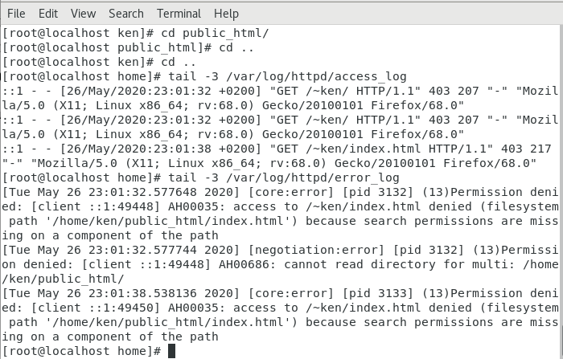

# Laboratoire SOS - SELINUX 

##### @author : Wenes Limem 
##### @email  : wenes.limem@heig-vd.ch
### Exercice sur SE Linux 

   -  Le script requiert une adresse ip passé en argument , puis il essaye de la pinger . 
   
   - L'utlisation de la méthode $_GET dans ce cas n'est pas une bonne pratique. Cette méthode affiche des informations sur l'url, dans notre cas, une adresse ip, ce qui n'est pas securisé du tout. 
   En plus , le paramètre $adresse n'est pas vérifier (ex : une adresse ip n'est composé que des chiffres)contre des manipulations externes. La commande __system__ peut donc exécuter une commande après avoir fini le ping , ce qui est dangereux. 
   
   - Une fois on accéde au fichier depuis le browser|curl , on arrive à voir la réponse de la commande ping. 

      ---- Screenshot ---- 

   -  Comme on a dit au début, l'url a été modifié pour que la méthode __system__ execute cat /etc/passwd. 

       
    
    Heuresement, le fichier ne peut pas être lu depuis l'exterieur, d'ou la réponse "no such file or directory". 
   
   -  Même chose pour le fichier _shadow_ que pour le fichier _passwd_ . 
   -  La prochaine étape de l'attacker serait d'escalader les privilièges de systemes à fin de récupérer le contenu de ces deux fichiers , donc avoir ses mains sur la mahcine cible. 

### Ken is here 

    - On a utilisé adduser pour ajouter le user _ken_ .
    - Changement de permission se fait avec chmod 705 home/ken dans notre cas . 
     7 : 111 : rwx pour Ken 
     0 : 000 : --- pour groupe 
     4 : 100 : r-x pour others

    - Pour les permissions de public html, on aura ces permissions : 
     7 : 111 : rwx pour Ken 
     0 : 000 : --- pour groupe 
     5 : 101 : r-x pour others 

### Use SELinux 
   - En accédent à la page web on a ce message : " Access forbidden" car ce dernier bloque l'executions des services httpd ailleurs que /var/www/html

 

 Ces logs journalisent les tentatives de connexion vers le public_html du user Ken. 
 D'après le log des erreurs, on peut voir qu'il s'agit des erreurs de permissions. 

- Affichage de 
 ´´´ 
 >  journalctl --since "5  minutes" ´´´  

 
 
 

 Pour avoir une meuilleur idée, on éxecute la commande porposée par le jorunal . 

 On a ça : 
  
  

Le journal nous propose de fixer une valeur true pour "enabler" l'accées du service httpd dans __/home/*/public_html 

 Voici une imprime écran du fichier attendu : 
  

  

- Pour la liste des booléens définies, la commande 
 > getseboolean -a 

nous permet d'avoir toutes les booleans définies. 

### Frank is here 

 - Lors de la création de son index.html , Franck est son propriétaire. Une fois __déplacé__ dans var/www/html  , le propriétaire ne va pas changer, et donc l'accées au fichier index.html de _franck_ n'est pas possible.

 D'après la commande journalctl, elle nous a donnée une idée sur le problème, ensuite , elle nous porpose de fixer le probleme en fixant une autre variable booleene de SElinux  httpd_read_user_content 1 

 

 Voilà une screenshot du contenu créer par Franck affiché avec Firefox| curl 
 